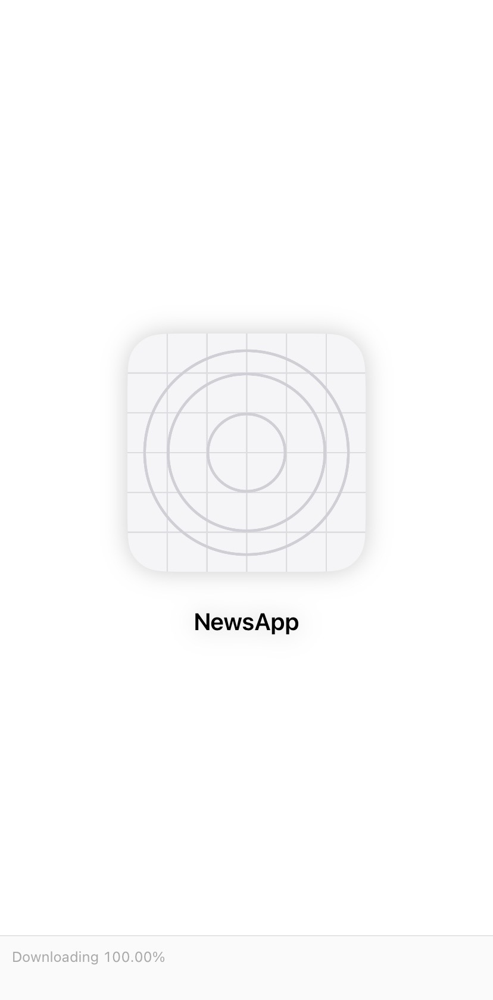
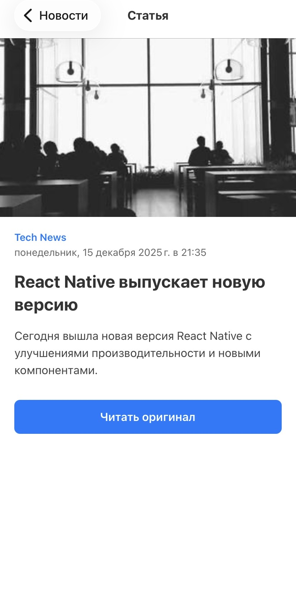

# 📰 NewsApp — Mobile news reading app


<p align="center">
  
</p>

**NewsApp** - is a modern cross-platform mobile application for reading news, built with React Native using Expo. The app provides up-to-date news across various categories, features a user-friendly interface, and runs on both iOS and Android.

## ✨ Features:
📱 Cross-platform — works on iOS and Android

  - 🗂️ News categories — top stories, business, technology, sports, entertainment, and more
  - 🔍 Detailed view — full articles with images
  - 🔄 Pull-to-refresh — refresh the news feed
  - 🎨 Modern UI — responsive design with animations
  - 🌐 Real API — integration with the GNews API
  - 💾 Offline mode — mock data when there is no internet connection
  - 📱 Native navigation — smooth transitions between screens

## 🚀 Quick Start
### Prerequisites

- [Node.js](https://nodejs.org/) (version 16 or higher)
- [npm](https://www.npmjs.com/) or [yarn](https://yarnpkg.com/)
- [Expo CLI](https://docs.expo.dev/get-started/installation/)
- A mobile device with [Expo Go](https://expo.dev/go) or an emulator

## 📸 Screenshots:

<div align="center">
  <table>
    <tr>
      <td></td>
      <td></td>
      <td></td>
    </tr>
    <tr>
      <td align="center">Loading Screen</td>
      <td align="center">News Details</td>
      <td align="center">Categories</td>
    </tr>
  </table>
</div>

## 🛠 Technologies:
  - React Native — cross-platform development
  - Expo — accelerated development and build tools
  - TypeScript — static typing and improved developer experience
  - React Navigation — screen navigation
  - GNews API — news data source
  - AsyncStorage (planned) — local storage
  - React Native Gesture Handler — gestures and animations

## 1. **Clone the repository**
   ```bash
   git clone https://github.com/bellatrisa1/newsAPP-RN.git
   cd NewsApp
npm install
# or
yarn install
